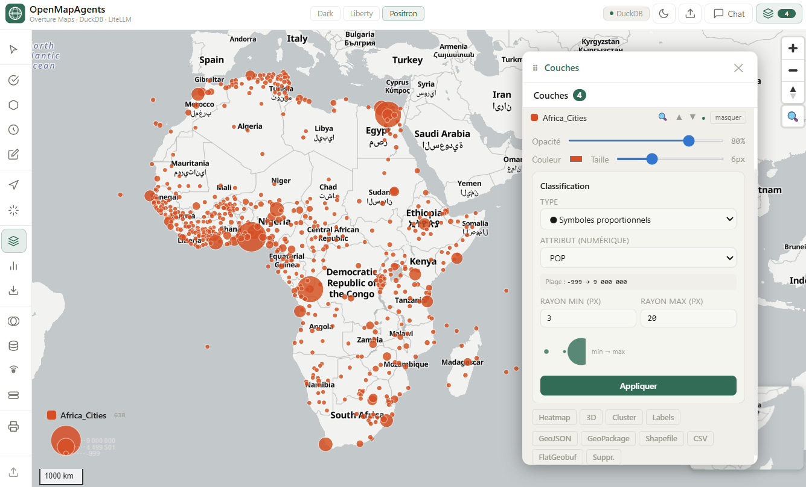

# Overture Maps Explorer

> Interface cartographique intelligente pour explorer, visualiser et analyser les données **Overture Maps**.
> Agent IA multi-provider avec routing, analyse spatiale, GEE et connexion DB externe.

**Stack :** React 18 + Vite · FastAPI · DuckDB · LiteLLM · MapLibre GL · Turf.js · MCP Server · Google Earth Engine

[](https://openmapagents.geoafrica.fr/)
---

## ⚡ Démarrage rapide (local)

Trois terminaux, cinq minutes. Prérequis : **Python 3.10+**, **Node.js 18+**, **Git**.

```bash
# 1. Cloner
git clone https://github.com/diouck/openmapagents.git
cd openmapagents

# 2. Backend (terminal 1)
cd backend
python3 -m venv venv && source venv/bin/activate      # Windows : venv\Scripts\activate
pip install --upgrade pip && pip install -r requirements.txt -r requirements_agent.txt
cp .env.example .env        # puis renseignez au moins une clé LLM dans backend/.env
python agent.py             # → http://localhost:8000  (API + /docs)

# 3. Frontend (terminal 2)
cd ../frontend
npm install
npm run dev                 # → http://localhost:5173
```

Ouvrez **http://localhost:5173**. Vite proxifie déjà `/api` vers `localhost:8000` (voir `vite.config.js`) — rien d'autre à configurer pour le mode dev.

- **Sous Linux**, tout ceci est automatisé par [`./install.sh`](install.sh) (voir plus bas).
- **La carte, les fonds OpenFreeMap, l'analyse spatiale et les ombres fonctionnent sans aucune clé API.** Les clés ne servent qu'aux modules optionnels (agent LLM, GEE, DB externe, Mapbox).
- Pour la **production** (build statique + nginx), voir [Déploiement en production](#déploiement-en-production).

---

## Architecture réelle du projet

```
openmapagents/
├── backend/
│   ├── agent.py              # ⭐ Backend principal — FastAPI + LiteLLM (multi-LLM)
│   ├── backend.py            # Backend simple — FastAPI + DuckDB seul (sans LLM)
│   ├── mcp_server.py         # MCP Server — 7 tools pour Claude Desktop / Cursor
│   ├── db_routes.py          # Router DB externe — PostgreSQL, MySQL, SQLite → GeoJSON
│   ├── gee_routes.py         # Router GEE — Sentinel-2, Landsat, MODIS, SRTM...
│   ├── requirements.txt      # FastAPI, DuckDB, GeoPandas, MCP...
│   ├── requirements_agent.txt # LiteLLM, python-dotenv, requests
│   └── .env                  # Clés API et configuration (créé à l'installation)
│
├── frontend/
│   ├── src/
│   │   ├── App.jsx           # Composant principal (version agent multi-panneaux)
│   │   ├── main.jsx          # Point d'entrée React + MapLibre CSS
│   │   ├── theme.js          # Thème dark/light avec CSS variables
│   │   ├── config.js         # API URL, styles carte, couleurs, export formats
│   │   ├── index.css         # Styles globaux
│   │   ├── components/       # ChatPanel, LayerPanel, GEEPanel, DBPanel...
│   │   └── utils/            # classification, helpers, spatial, routing, makiLoader
│   ├── package.json
│   └── vite.config.js        # Proxy /api → localhost:8000
│
├── data/cache/               # Cache DuckDB local (JSON)
├── install.sh                # ← Script d'installation Linux
├── setup.ps1                 # Script d'installation Windows
├── install_maplibre.ps1      # Installation MapLibre (Windows)
├── overture_explorer.jsx     # Version standalone (sans composants séparés)
└── README.md
```

---

## Prérequis

| Outil | Version minimale | Rôle |
|-------|-----------------|------|
| Python | 3.10+ | Backend FastAPI + DuckDB |
| Node.js | **18+** | Frontend Vite/React |
| npm | 9+ | Packages frontend |
| Git | 2.x | Clone du repo |

---

## Installation Linux (Ubuntu / Debian / Fedora / Arch)

### Méthode rapide

```bash
git clone https://github.com/diouck/openmapagents.git
cd openmapagents
chmod +x install.sh
./install.sh
```

Le script installe automatiquement :
- Les dépendances système (Python, Node.js 18+, GDAL, spatialindex)
- L'environnement virtuel Python avec tous les packages (core + agent + GEE + DB)
- Les dépendances npm (react-map-gl, maplibre-gl, @turf/turf, d3, recharts, lucide-react)
- Les fichiers frontend manquants (index.html, package.json, vite.config.js)
- Un fichier `.env` à configurer avec votre clé API LLM
- Les scripts `start_*.sh` prêts à l'emploi
- La configuration MCP dans `~/.config/Claude/claude_desktop_config.json`

### Après installation

```bash
# 1. Configurer votre provider LLM
nano backend/.env
# → décommenter ANTHROPIC_API_KEY=sk-ant-... (ou OpenAI, Ollama, etc.)

# 2. Lancer tout en une commande
./start_all.sh
```

### Scripts disponibles

| Script | Description | URL |
|--------|-------------|-----|
| `./start_backend.sh` | Agent LiteLLM multi-LLM | http://localhost:8000 |
| `./start_backend_simple.sh` | DuckDB seul, sans LLM | http://localhost:8000 |
| `./start_frontend.sh` | Interface React | http://localhost:5173 |
| `./start_mcp.sh` | MCP Server (Claude Desktop) | stdio |
| `./start_all.sh` | Tout en une commande | — |

### Installation manuelle étape par étape

#### Backend

```bash
cd backend
python3 -m venv venv
source venv/bin/activate
pip install --upgrade pip

# Core (DuckDB, FastAPI, GeoPandas)
pip install -r requirements.txt

# Agent LiteLLM
pip install -r requirements_agent.txt

# Optionnel — DB externe (PostgreSQL, MySQL)
pip install sqlalchemy psycopg2-binary pymysql

# Optionnel — Google Earth Engine
pip install earthengine-api google-auth google-auth-httplib2

# Lancer l'agent (LiteLLM multi-LLM)
python agent.py
# → http://localhost:8000  |  Docs : http://localhost:8000/docs

# Ou le backend simple (DuckDB seul)
python backend.py
```

#### Frontend

```bash
cd frontend
npm install
npm run dev
# → http://localhost:5173
```

#### MCP Server (Claude Desktop / Cursor)

Créer ou éditer `~/.config/Claude/claude_desktop_config.json` :

```json
{
  "mcpServers": {
    "overture-maps": {
      "command": "/chemin/vers/backend/venv/bin/python",
      "args": ["/chemin/vers/backend/mcp_server.py"],
      "env": {
        "OVERTURE_RELEASE": "2026-03-18.0",
        "DUCKDB_MEMORY": "4GB"
      }
    }
  }
}
```

---

## Installation Windows

```powershell
# Cloner et installer
git clone https://github.com/diouck/openmapagents.git
cd openmapagents
.\setup.ps1

# Installer MapLibre dans le frontend
cd frontend
..\install_maplibre.ps1
```

Ou manuellement :

```powershell
# Backend
cd backend
python -m venv venv
venv\Scripts\activate
pip install -r requirements.txt -r requirements_agent.txt
python agent.py

# Frontend (autre terminal)
cd frontend
npm install
npm run dev
```

---

## Configuration (backend/.env)

La configuration se fait dans `backend/.env`. Un gabarit complet **sans secrets** est fourni : **[`backend/.env.example`](backend/.env.example)**. Copiez-le puis renseignez vos valeurs :

```bash
cp backend/.env.example backend/.env
# puis éditez backend/.env
```

À renseigner au minimum :

```dotenv
# Provider : claude | openai | ollama | openrouter | deepseek | mistral
LLM_PROVIDER=openrouter
OPENROUTER_API_KEY=            # ou ANTHROPIC_API_KEY / OPENAI_API_KEY… selon le provider

# PostgreSQL / pgvector (RAG)
PG_HOST=localhost
PG_PASSWORD=

# Cartographie (optionnel)
MAPTILER_API_KEY=
VITE_MAPBOX_TOKEN=            # token Mapbox — public par nature, restreignez-le par URL côté Mapbox

OVERTURE_RELEASE=2026-03-18.0
BACKEND_PORT=8000
```

> ⚠️ **Ne committez jamais `backend/.env`** (il est ignoré par git). N'écrivez aucune clé réelle dans le code source, la doc ou tout fichier versionné : **le dépôt est public**. Le frontend lit le token Mapbox via `VITE_MAPBOX_TOKEN` injecté au build (`npm run build`).

---

## Fonctionnalités

### 🗺️ Carte interactive (MapLibre GL)
Fonds de carte OpenFreeMap (dark, liberty, positron) — sans clé API. Turf.js côté client pour l'analyse spatiale.

### 🤖 Agent IA (ChatPanel)
Interrogation en langage naturel via LiteLLM. Tools : `geocode`, `query_overture`, `fly_to`, `spatial_analysis`, `compute_route`, `compute_isochrone`, `set_layer_style`, `remove_layer`, `get_layer_stats`.

### 📡 Données Overture Maps (DuckDB → S3)
Requêtes directes sur les GeoParquet Overture Maps hébergés sur S3 AWS (release `2026-03-18.0`). Thèmes : places, buildings, transportation, divisions, base, addresses.

### 🛰️ Google Earth Engine (GEEPanel)
Sentinel-2, Landsat 8/9, MODIS LST/NDVI, ESA WorldCover, Sentinel-1 SAR, SRTM, ERA5. Indices : NDVI, NDWI, NDBI, EVI, LST, RGB, False Color.

### 🗄️ Connexion DB externe (DBPanel)
PostgreSQL (PostGIS), MySQL spatial, SQLite. Retour GeoJSON avec support WKT, ST_AsGeoJSON, colonnes lat/lon.

### 🔀 Analyse spatiale (SpatialPanel)
Operations Turf.js : intersection, union, difference, clip, buffer, points_in_polygon, spatial_join, clustering DBSCAN, centroid, convex_hull, voronoi, hex_grid, dissolve, simplify.

### 🚗 Routing & Isochrones
Itinéraires (pied, vélo, voiture) et zones d'accessibilité via Mapbox Directions/Isochrone API.

---

## API Endpoints (agent.py)

| Méthode | Route | Description |
|---------|-------|-------------|
| GET | `/` | Info service + provider LLM actif |
| GET | `/api/config` | Config frontend (provider, modèle, thèmes) |
| POST | `/api/chat` | Chat avec l'agent (tool calling LiteLLM) |
| POST | `/api/query/{theme}` | Requête DuckDB directe (bypass LLM) |
| GET | `/api/query` | Requête GET (re-query auto-clip frontend) |
| POST | `/api/export` | Export GeoJSON |
| POST | `/api/db/test` | Test connexion DB externe |
| POST | `/api/db/tables` | Liste des tables |
| POST | `/api/db/query` | Requête SQL → GeoJSON |
| GET | `/api/gee/health` | Statut GEE |
| GET | `/api/gee/datasets` | Catalogue datasets GEE |
| POST | `/api/gee/tiles` | URL tuiles XYZ GEE |
| POST | `/api/gee/dates` | Dates disponibles pour un dataset |

## MCP Tools (mcp_server.py)

| Tool | Description |
|------|-------------|
| `query_places` | POI par bbox, catégorie, nom, confiance |
| `query_buildings` | Bâtiments par bbox et hauteur |
| `query_transport` | Réseau routier par bbox et classe |
| `spatial_stats` | Stats agrégées (count, catégories, hauteurs) |
| `h3_density` | Densité hexagonale H3 (résolution 4-12) |
| `export_overture` | Génération requête DuckDB d'export |
| `raw_duckdb_query` | Requête SQL DuckDB libre |

---

## Dépannage

**GDAL introuvable (Ubuntu) :**
```bash
sudo apt-get install libgdal-dev gdal-bin
pip install gdal==$(gdal-config --version)
```

**Node.js < 18 :**
```bash
curl -fsSL https://deb.nodesource.com/setup_20.x | sudo -E bash -
sudo apt-get install -y nodejs
```

**Erreur DuckDB httpfs / S3 :**
```bash
# Vérifier l'accès réseau S3
python3 -c "import duckdb; c=duckdb.connect(); c.execute('INSTALL httpfs; LOAD httpfs;'); print('OK')"
```

**GEE : credentials non trouvés :**
```bash
source backend/venv/bin/activate
earthengine authenticate
# Suivre le lien OAuth et copier le token
```

**Port 8000 déjà utilisé :**
```bash
lsof -i :8000         # trouver le processus
# ou changer BACKEND_PORT dans backend/.env
```


## Déploiement en production

En production, le frontend est **compilé en statique** et servi par **nginx** ; seul le backend tourne en arrière-plan. Chemin type : `/var/www/openmapagents`.

```bash
# 1. Build du frontend → frontend/dist/ (servi par nginx)
cd /var/www/openmapagents/frontend
npm install
npm run build

# 2. Backend en service systemd (redémarre au reboot)
sudo systemctl enable openmapagents
sudo systemctl start openmapagents
sudo systemctl status openmapagents      # vérifier
```

Nginx sert directement `frontend/dist/` et proxifie `/api` vers `http://localhost:8000` (le backend). Un éventuel token Mapbox est injecté **au build** via `VITE_MAPBOX_TOKEN` : après avoir changé une clé `VITE_*`, relancez `npm run build`.

> Pas encore de service systemd ? Lancer le backend seul à la main :
> ```bash
> cd /var/www/openmapagents/backend && source venv/bin/activate
> nohup python agent.py > /var/log/openmapagents-backend.log 2>&1 &
> ```

---

## Mise à jour / redéploiement

Déployer la dernière version. L'historique distant pouvant être réécrit, utilisez `reset --hard` (**pas** `git pull`) :

```bash
cd /var/www/openmapagents
git fetch origin
git reset --hard origin/main

# Frontend : reconstruire le statique servi par nginx
cd frontend && npm install && npm run build

# Backend : redémarrer le service
sudo systemctl restart openmapagents
```

---

**Auteur :** Kane Diouck — [diouckk@gmail.com](mailto:diouckk@gmail.com)
**GitHub :** [github.com/diouck](https://github.com/diouck)
